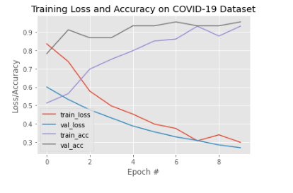
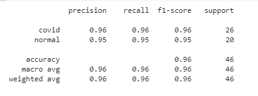
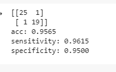

#### ♦♦ The work in here is purely exploratory and  NOT INTENDED FOR DIAGNOSTIC PURPOSES ♦♦

### COVID-19 X-Rays PREDICTOR
Project Summary: to use X-Ray lung images to detect COVI-19 positive cases using Machine Learning. 

Deep learning techniques for image analysis and classification Xray images can be used to spot anomalies and aid healthcare personnel in the diagnosis. 

By CDC/ Alissa Eckert, MS; Dan Higgins, MAM - from CDC (https://commons.wikimedia.org/w/index.php?curid=86444014)

## Requirements
The main requirements are listed below:

- Tested with Tensorflow 
- OpenCV 4.2.0
- Python 3.6
- Numpy
- Scikit-Learn
- Matplotlib

Additional requirements to generate dataset:

- PyDicom
- Pandas
- Jupyter/CoLab

## Data
In ML good quality data is key. The datasets were constructed from:

- https://github.com/ieee8023/covid-chestxray-dataset
- https://www.kaggle.com/c/rsna-pneumonia-detection-challenge (which came from: https://nihcc.app.box.com/v/ChestXray-NIHCC)

The obtain the dataset with covid-19 images I cloned the repository and downloaded the metadata.csv and /images/ folder into a folder /covid-chest-xray/ in my goggle drive '/content/drive/My Drive/covid-chest-xray/'
To obtain the dataset for the normal x-rays I downloaded the rsna pneumonia dataset and downloaded the data into a folder '/pneumonia-chest-xray/' in my goggle drive. 

Those two datasets were used to build a new dataset with covid x-rays ['/data/covid'](data/covid) and non-covid x-rays ['/data/normal'](data/normal). All the programming was in Google CoLab. 

## Inspect the Metadata of the Covid-19 dataset
The [metadata](metadata.csv) from the Covid dataset has interesting information about the images like findings (COVID, SARS, MERS, PNEUMONIA among others) sex, age, survival, or views. The set I am interested is the Posteroanterior view (PA) and findings : Covid-19. 

## PROCESSING
Basic steps:
 - 1 Build a normal ['/data/normal'](data/normal) and covid-19 xray['/data/covid'](data/covid) datasets
 - 2 Preprocess data by changing color and reshaping to (224,224), default input size for the model
 - 3 Normalizing for deep learning and perform one-hot encoding 
 - 4 Build the train and the test sets 

## MODELING 

Create a Convolutional Neural Network using Keras, TensorFlow and deep learning in Google Colab. 

- 1 Load the VGG16 network https://keras.io/applications/#vgg16
- 2 Compile the using Adam optimizer and fit using 10 epocs

 

## EVALUATION OF the MODEL AND PREDICTION

- 1 Model was tested with unseen data with a precision of 96% 
- 2 The model was saved using HDF5 binary format

The model has an accuracy of 96% based only on x-ray images and no other feature. Sensitivity of 96 % and specificity of 95% means that from patients that HAVE COVID-19 the model accurately identifies them as positive in 96% of the cases. From patients that do NOT HAVE COVID-19, the model identified as covid negative 96 % of the time. 

As always how good or bad is any diagnosis tool depends on the context that is used. In this case it will be really bad if the model missed a covid-19 positive and goes home thinking is negative and spreads the infection further. 

[loss: 0.2678 - accuracy: 0.9565]

##  CHECK YOUR OWN XRAY IMAGES

The last part is meant to allow to check x-ray images for covid-19. These are the steps I followed: 
 
- 1 I downloaded some images on my Google Drive. In this example I downloaded an image courtesy of Dr Fabio Macori, Radiopaedia.org. From the case rID: 74887  

- 2 Load the image to CoLab, and performed image preprocess (color conversion, re-sizing, and scaling)
- 3 Re-shaping array 
- 4 Load the model and do prediction  

In this case, the model accurately predicted that the image was Covid-19 positive. 

##  Further steps

- To improve the model is always important to have more data. Hence adding new data seems the next logic step. 
- To improve performance of this approach the rest of the metadata should be studied. Finding other features that may be relevant could help nurses/doctors to triage patients faster. 
- To improve Using CT scans may be better in some cases where lung damage is not as generalized or other organs may be affected. However, CT scans are not only more expensive but time consuming and time is exposure for healthcare personnel. 

Credits: 
This notebook is based on the tutorial [here](https://www.pyimagesearch.com/2020/03/16/detecting-covid-19-in-x-ray-images-with-keras-tensorflow-and-deep-learning/)
and this paper [here](https://arxiv.org/pdf/2003.09871v3.pdf) and tons of Medium articles 

## Feel free to contact me

* Marina Marinkovic/PdeM: [LinkedIn](https://www.linkedin.com/in/marinamarinkovic/) | [GitHub](https://github.com/MPdeM)
